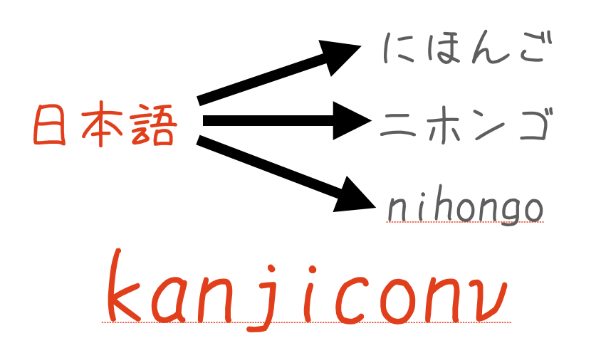

# kanjiconv

[](https://opensource.org/licenses/Apache-2.0)
[](https://pepy.tech/projects/kanjiconv)

Japanese REAMED is here.  （日本語のREADMEはこちらです。）  
https://github.com/sea-turt1e/kanjiconv/blob/main/README_ja.md



Kanji Converter to Hiragana, Katakana, Roman alphabet.  
You can get the reading and pronunciation of Japanese sentences based on sudachidict.  
Sudachidict is a regularly updated dictionary, so it can relatively handle new proper nouns and other terms.

## Local MCP Server
If you want to use kanjiconv as a local MCP Server, see [kanjicon-mcp](https://github.com/sea-turt1e/kanjiconv_mcp)

```bash

## My Environments
```
python>=3.11.7
```

## Install
### Install kanjiconv
```bash
pip install kanjiconv
```

If you want to use the UniDic dictionary with the use_unidic option, please download the unidic dictionary.

```bash
python -m unidic download
```

## How to use
### Import & Create Instance
```python
from kanjiconv import KanjiConv

# Basic usage
kanji_conv = KanjiConv(separator="/")

# Using UniDic for improved kanji reading accuracy
kanji_conv = KanjiConv(separator="/", use_unidic=True)

# Using custom dictionary for kanji readings not covered by SudachiDict or UniDic
kanji_conv = KanjiConv(separator="/", use_custom_readings=True)
```

### Get Reading
```python
# convert to hiragana
text = "幽☆遊☆白書は、最高の漫画デス。"
print(kanji_conv.to_hiragana(text))
ゆうゆうはくしょ/は/、/さいこう/の/まんが/です/。

# convert to katakana
text = "幽☆遊☆白書は、最高の漫画デス。"
print(kanji_conv.to_katakana(text))
ユウユウハクショ/ハ/、/サイコウ/ノ/マンガ/デス/。

# convert to Roman alphabet
text = "幽☆遊☆白書は、最高の漫画デス。"
print(kanji_conv.to_roman(text))
yuuyuuhakusho/ha/, /saikou/no/manga/desu/. 

# You can change separator to another character or None
kanji_conv = KanjiConv(separator="_")
print(kanji_conv.to_hiragana(text))
ゆうゆうはくしょ_は_、_さいこう_の_まんが_です_。

kanji_conv = KanjiConv(separator="")
print(kanji_conv.to_hiragana(text))
ゆうゆうはくしょは、さいこうのまんがです。
```

## Using Custom Kanji Reading Dictionary
KanjiConv supports a custom dictionary for handling special kanji readings that are not properly recognized by SudachiDict or UniDic. This is particularly useful for:

1. Special expressions with unique readings
2. Technical terms or proper nouns
3. Ambiguous kanji with multiple readings based on context

The custom dictionary is automatically loaded from the package if available, but you can also define your own:

```python
from kanjiconv import KanjiConv

# Create instance with custom readings enabled (enabled by default)
kanji_conv = KanjiConv(separator="/", use_custom_readings=True)

# You can also define your own custom readings
kanji_conv.custom_readings = {
    "single": {
        "激": ["げき"],
        "飛": ["と", "ひ"]
    },
    "compound": {
        "激を飛ばす": "げきをとばす",
        "飛ばす": "とばす"
    }
}

# Now the special expression will be properly converted
print(kanji_conv.to_hiragana("激を飛ばす"))
# Output: げき/を/とばす
```

### Custom Dictionary Structure
The custom dictionary uses the following format:

- `single`: A dictionary mapping individual kanji to their reading(s)
  - Each kanji can have multiple readings as a list
  - The first reading in the list is used as default
- `compound`: A dictionary mapping multi-character expressions to their reading
  - These are processed before tokenization and given priority

## (Optional) Installing sudachidict other than the default
The default dictionary is sudachidict_full. If you want to use a lighter dictionary, you can install either sudachidict_small or sudachidict_core.
- If you need detailed readings, we recommend using sudachidict_full. The default is set to sudachidict_full.
- If you prefer lighter operation, sudachidict_small is recommended.
- sudachidict_core offers a balanced option between speed and accuracy.
```bash
pip install sudachidict_small
pip install sudachidict_core
```
- If using sudachidict_small or sudachidict_core, specify it like this:
```python
kanji_conv = KanjiConv(sudachi_dict_type="small", separator="/")
kanji_conv = KanjiConv(sudachi_dict_type="core", separator="/")
```

## Update Dict
kanjiconv reading function is based on SudachiDict, and you need to update SudachiDict regularly via pip.
```bash
pip install -U sudachidict_full
pip install -U sudachidict_small
pip install -U sudachidict_core
```

## License

This project is licensed under the [Apache License 2.0](LICENSE).

### Open Source Software Used

- [SudachiPy](https://github.com/WorksApplications/SudachiPy): Apache License 2.0
- [SudachiDict](https://github.com/WorksApplications/SudachiDict): Apache License 2.0
- [fugashi](https://github.com/polm/fugashi): MIT License
- [unidic-py](https://github.com/polm/unidic-py): MIT License

This library uses SudachiPy and its dictionary SudachiDict for morphological analysis. These are also distributed under the Apache License 2.0.

For detailed license information, please refer to the LICENSE files of each project:

- [SudachiPy LICENSE](https://github.com/WorksApplications/SudachiPy/blob/develop/LICENSE)
- [SudachiDict LICENSE](https://github.com/WorksApplications/SudachiDict/blob/develop/LICENSE-2.0.txt)
- [fugashi LICENSE](https://github.com/polm/fugashi/blob/main/LICENSE)
- [unidic-py LICENSE](https://github.com/polm/unidic-py/blob/master/LICENSE)
